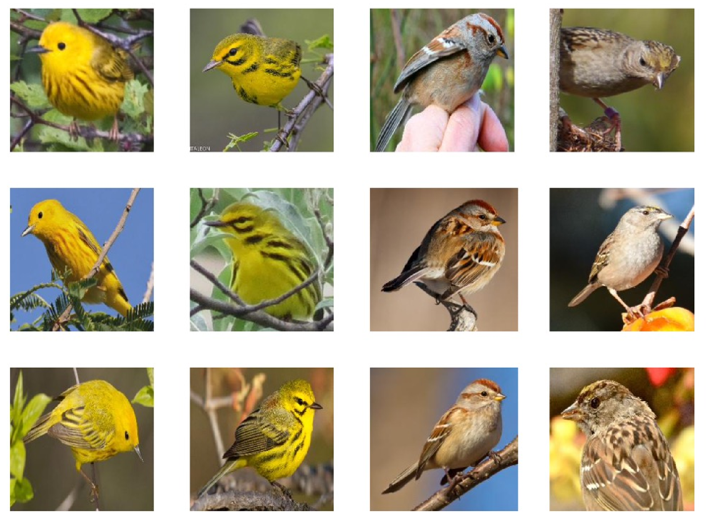
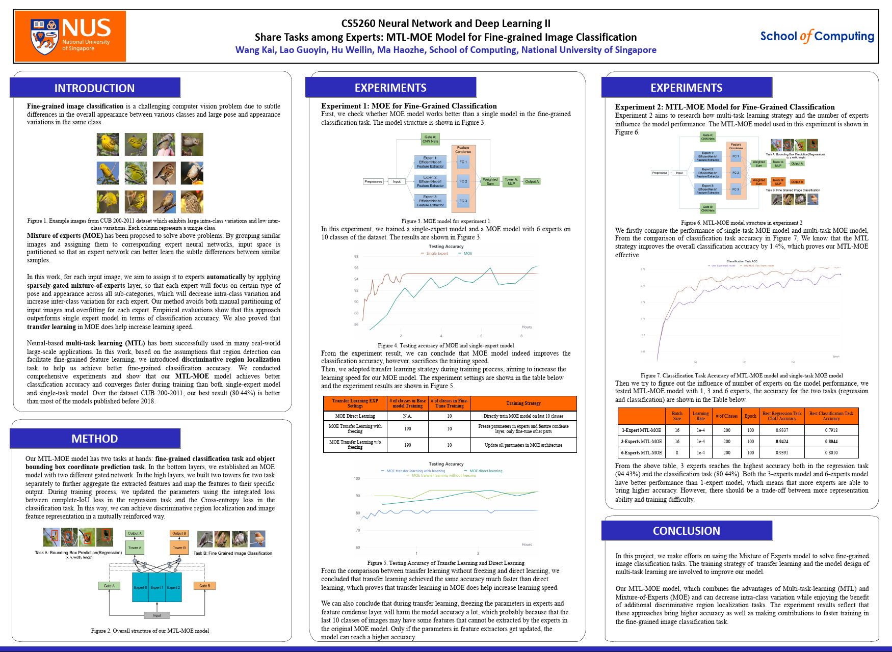

# Share Tasks among Experts: MTL-MOE Model for Fine-grained Image Classification

**Fine-grained image classification** is a challenging computer vision problem due to subtle
differences in the overall appearance between various classes and large pose and appearance
variations in the same class.

_Figure 1. Example images from CUB 200-2011 dataset which exhibits large intra-class variations and low inter-class variations. Each column represents a unique class._

**Mixture of experts (MOE)** has been proposed to solve above problems. By grouping similar
images and assigning them to corresponding expert neural networks, input space is
partitioned so that an expert network can better learn the subtle differences between similar
samples.

In this work, for each input image, we aim to assign it to experts **automatically** by applying
**sparsely-gated mixture-of-experts** layer, so that each expert will focus on certain type of
pose and appearance across all sub-categories, which will decrease intra-class variation and
increase inter-class variation for each expert. Our method avoids both manual partitioning of
input images and overfitting for each expert. Empirical evaluations show that this approach
outperforms single expert model in terms of classification accuracy. We also proved that
**transfer learning** in MOE does help increase learning speed.

Neural-based **multi-task learning (MTL)** has been successfully used in many real-world
large-scale applications. In this work, based on the assumptions that region detection can
facilitate fine-grained feature learning, we introduced **discriminative region localization**
task to help us achieve better fine-grained classification accuracy. We conducted
comprehensive experiments and show that our **MTL-MOE** model achieves better
classification accuracy and converges faster during training than both single-expert model
and single-task model. Over the dataset CUB 200-2011, our best result (80.44%) is better
than most of the models published before 2018.

## Poster

### [Project Poster](Project_Poster.pdf)

## Group Members

Wang Kai, Lao Guoyin, Hu Weilin, Ma Haozhe

## Course Info

Projects for National University of Singapore, School of Computing, [CS5260 Neural Networks and Deep Learning II Module](https://nusmods.com/modules/CS5260/neural-networks-and-deep-learning-ii).
